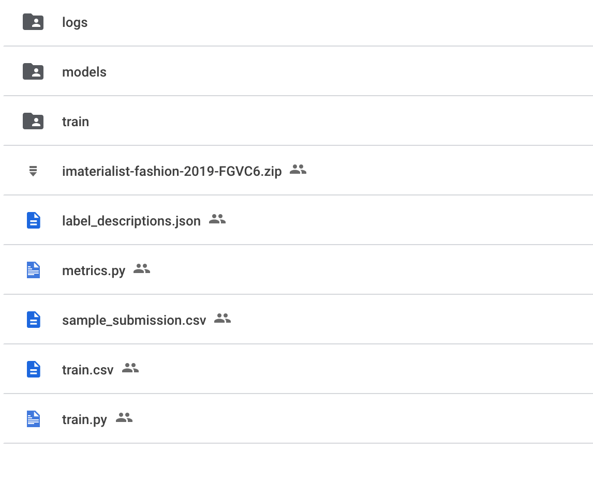

# How To Run Colab Notebook
- Create a technovation directory in google drive.
- Copy content of ./technovation directory in  google drive's technovation directory.
- Execute technovation_notebook.ipynb section **Prepare Environment** to download kaggle dataset in your google drive(Note it might require more than 40GB of availabe disk space to succefully download it). 
- After downlading and unzipping the data the file structure should look like below:

# References
- https://www.analyticsvidhya.com/blog/2021/06/how-to-load-kaggle-datasets-directly-into-google-colab (Instructions on how to load kaggle data into google drive)
- https://www.kaggle.com/c/imaterialist-fashion-2019-FGVC6 (kaggle data used)
- https://github.com/IlliaOvcharenko/imaterialist-fashion-2019-FGVC6 (Original repo we based our colab)
